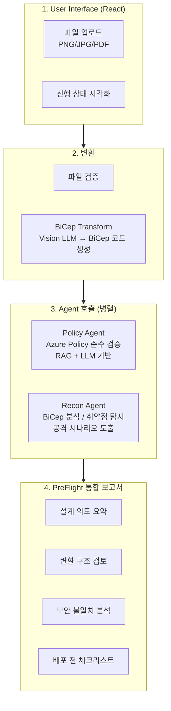

# 아키텍처 설계

## 구현 범위

### 실제 구현

1. **User Interface**
   - React.js - 프로덕션용 프론트엔드 (`frontend/` 디렉토리)
2. **Recon Agent** - 전체 구현
3. **API Layer (FastAPI + Gunicorn)** - 전체 구현

### Mock 구현 (추후 실제 전환)

- Azure Blob Storage 연동
- 워크플로우 오케스트레이터

---

## 전체 파이프라인 흐름

---

## 컴포넌트 상세

### 1. User Interface

**현재 구현 (React.js - `frontend/`):**

- 파일 업로드 (PDF, PNG, JPG)
- 5단계 파이프라인 시각화
- 취약점 목록 및 보안 권장사항 표시
- 마크다운 보고서 렌더링
- 기존 FastAPI 엔드포인트 (`/api/v1/*`) 사용

### 2. Recon Agent

**핵심 기능:**

1. **BiCep 코드 분석** - 리소스 구성 이해 및 관계 분석
2. **취약점 탐지** - 보안 설정 오류, 네트워크 노출 위험, 인증/인가 검증, 암호화 누락
3. **공격 시뮬레이션** - 잠재적 공격 벡터 도출, 취약점 악용 시나리오 작성
4. **결과 제공** - 심각도별 취약점 분류 및 JSON 출력

### 3. PreFlight Agent

**핵심 기능:**

1. **설계 의도 분석** - 원본 Bicep에서 의도된 보안 설계 요약
2. **변환 구조 검토** - Bicep → Docker Compose 등 변환 과정에서의 보안 통제 유지 여부
3. **불일치 분석** - 네트워크 격리, 퍼블릭 노출, TLS 강제, 접근 제어 모델 변화 검토
4. **보고서 생성** - Policy + Recon 결과 통합, 조건부 표현으로 위험 가능성 설명, 배포 전 체크리스트 제공

### 4. API Layer

**핵심 기능:**

1. **파일 업로드 엔드포인트** - 파일 검증 (크기 20MB, 포맷), 비동기 처리
2. **오케스트레이션** - BiCep 변환 → Policy Agent & Recon Agent 병렬 호출 → PreFlight 통합 보고서 생성
3. **상태 관리** - `GET /api/v1/status/{task_id}` 진행 상태 조회
4. **에러 핸들링** - 표준화된 에러 응답 및 로깅

---

## API 호출 시퀀스

```mermaid
sequenceDiagram
    participant U as User (Browser)
    participant R as React Frontend
    participant A as FastAPI
    participant B as BiCep Transformer
    participant P as Policy Agent
    participant RC as Recon Agent
    participant PF as PreFlight Agent

    U->>R: 파일 업로드
    R->>A: POST /api/v1/analyze
    A->>B: BiCep 변환 (Vision LLM)
    B-->>A: BiCep 코드
    A->>P: Policy 검증 (병렬)
    A->>RC: Recon 분석 (병렬)
    P-->>A: 정책 위반 결과
    RC-->>A: 취약점 보고서
    A->>PF: PreFlight 통합 보고서 생성
    PF-->>A: 통합 보고서 (Markdown)
    A-->>R: 분석 결과
    R-->>U: 결과 표시
```

---

## Mock 서비스 명세

| 서비스             | 현재 동작                           | 비고                                     |
| ------------------ | ----------------------------------- | ---------------------------------------- |
| Blob Storage       | 인메모리 딕셔너리 저장              | Azure Blob Storage 연동 예정             |
