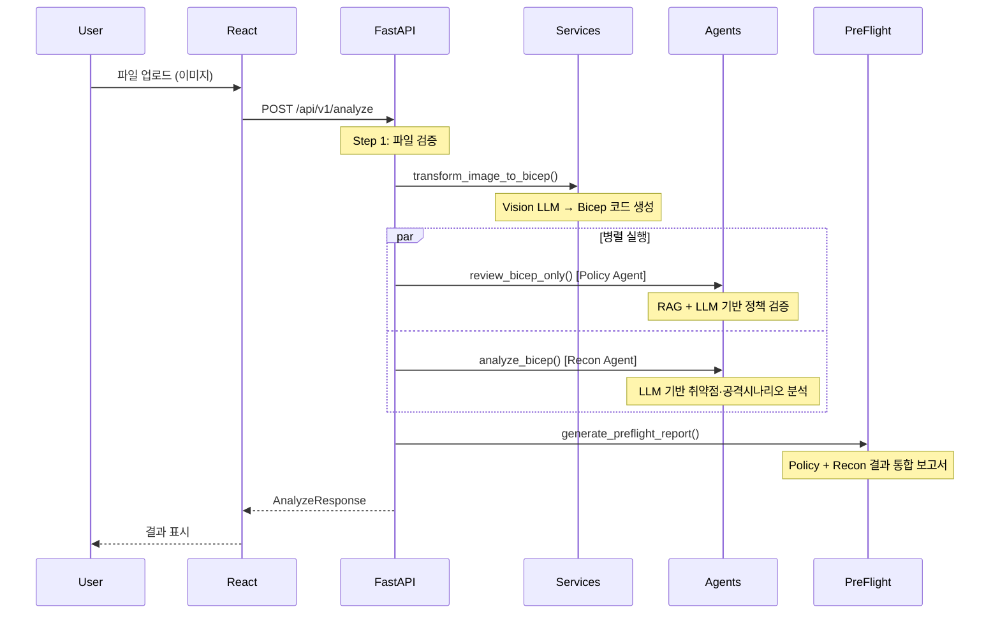

# 에이전트 워크플로우

## 현재 구현 상태

- **Policy Agent**: RAG + LLM 기반 실제 구현 (Azure OpenAI + manifest.json 기반 정책 검토)
- **Recon Agent**: LLM 기반 실제 구현 (`new_agent_wrapper_v2.py`)
- **BiCep Transform**: Vision LLM 기반 이미지 → Bicep 변환 (AI Foundry)
- **PreFlight Agent**: MAF 기반 통합 보안 보고서 생성 (`preflight_agent.py`)

---

## 워크플로우 흐름

---

## 코드 흐름 상세

| 단계 | 파일 | 함수/클래스 | 설명 |
|------|------|-------------|------|
| 1 | `api/routers/analyze.py` | `analyze_architecture()` | 진입점 - 파일 검증 |
| 2 | `api/common/services/bicep_transformer.py` | `transform_image_to_bicep()` | Vision LLM으로 이미지 → Bicep 변환 |
| 3 | `agents/policy_agent.py` | `review_bicep_only()` | RAG + LLM 기반 정책 검증 (병렬) |
| 4 | `agents/new_agent_wrapper_v2.py` | `analyze_bicep()` | LLM 기반 취약점·공격시나리오 분석 (병렬) |
| 5 | `agents/preflight_agent.py` | `generate_preflight_report()` | Policy + Recon 통합 해설 보고서 생성 |

---

## 환경 변수

| 변수 | 용도 |
|------|------|
| `AI_FOUNDRY_ENDPOINT` | Vision LLM (이미지 → Bicep 변환) |
| `AI_FOUNDRY_API_KEY` | Vision LLM 인증 |
| `AZURE_OPENAI_ENDPOINT` | Policy Agent + Recon Agent LLM |
| `AZURE_OPENAI_API_KEY` | Azure OpenAI 인증 |
| `AZURE_OPENAI_DEPLOYMENT_NAME` | 사용할 배포 모델명 |
| `AZURE_OPENAI_API_VERSION` | API 버전 |
